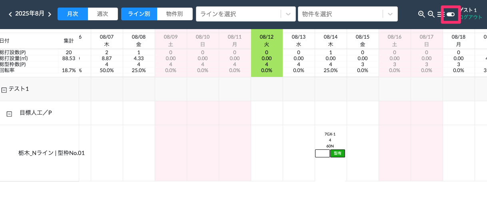
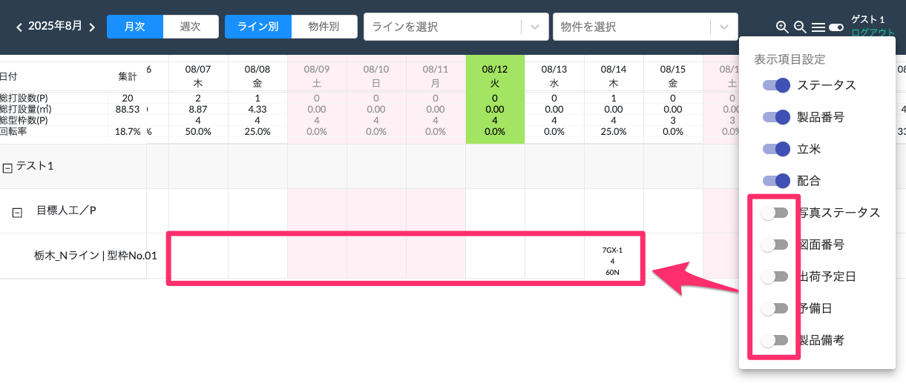

# 項目の表示/非表示

 
1. [WEB工程表]画面右上のトグルボタンから項目ごとの表示/非表示の選択ができます。

    <table><tr><td>
    
    </td></tr></table>

2. 非表示にしたい場合は、トグルボタンをオフにすることで非表示にすることができます。
   ※ステータスと製品番号は表示固定で非表示にはできません。

    <table><tr><td>
    
    </td></tr></table>

    {: .note }
    この設定はブラウザごとに記憶され、次回起動時も保持されます。