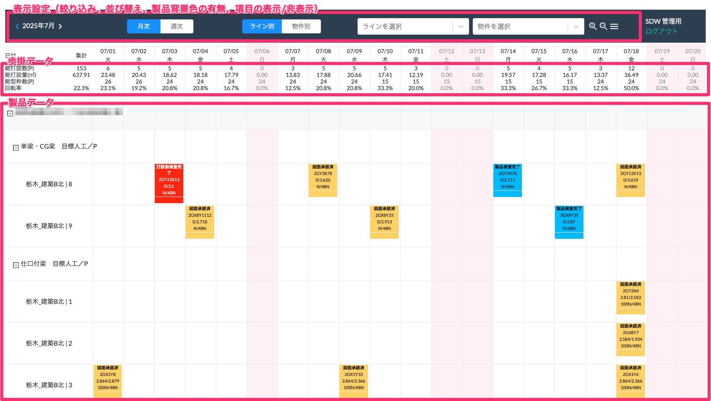

# 工程管理

### 画面概要

<table><tr><td>

</td></tr></table>

### 項目詳細

|                            | 詳細                                                                                                                                                                                                                                                                 | 過去の日付     | 参照元                                                   | 備考                                                                               | 
| -------------------------- | -------------------------------------------------------------------------------------------------------------------------------------------------------------------------------------------------------------------------------------------------------------------- | -------------- | -------------------------------------------------------- | ---------------------------------------------------------------------------------- | 
| 総打設数(P)                | その日[表示期間]打設予定の製品の合計数                                                                                                                                                                                                                               | 再計算しない   | 基幹システム：製品 > 打設完了予定日                      |                                                                                    | 
| 総打設量(㎥)               | その日[表示期間]打設予定の生産量の合計                                                                                                                                                                                                                               | 再計算しない   | 基幹システム：製品 > ㎥                                  |                                                                                    | 
| 総型枠数(P)                | 当月に打設する物件の部位毎の型枠の総数(打設完了したものは減算していく)                                                                                                                                                                                               | 再計算しない   | 基幹システム：物件、部位、型枠                           |                                                                                    | 
| 回転率                     | 総打設数 / 総型枠数（小数点第1位まで）                                                                                                                                                                                                                               | 再計算しない   |                                                          |                                                                                    | 
