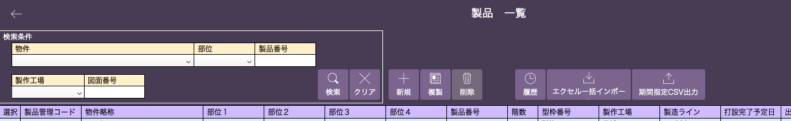

# 製品マスタ画面他機能

<table><tr><td>

</td></tr></table>

### ヘッダー詳細

- 検索、クリア
    
    検索条件欄で[物件]、[部位]を選択([マスタの事前設定]()が必要)、[製品番号]、[製作工場]、[図面番号]を入力後「検索」を選択すると該当する製品が絞り込まれます。「クリア」を選択すると絞り込みが解除されます。
    
- 新規
    
    未記入の行が追加されます。絞り込みをしている場合は、「クリア」を選択すると追加された行が表示されます。
    
- 複製
    
    複製したい製品の行を選択し背景が青い状態で「複製」を選択すると、同内容の製品が追加されます。絞り込みをしている場合は、再度「検索」か「クリア」をすると追加された製品が表示されます。
    
- 削除
    
    削除したい製品の選択列チェックボックスにチェックを入れた状態で「削除」を選択すると、一覧から非表示になります。削除した製品は、製品一覧の検索結果や各システムの参照対象から除外されます。データそのものは削除されません。

- 履歴
    
    過去の変更履歴(直接編集、新規、複製、削除、インポート 等)を確認できます。
