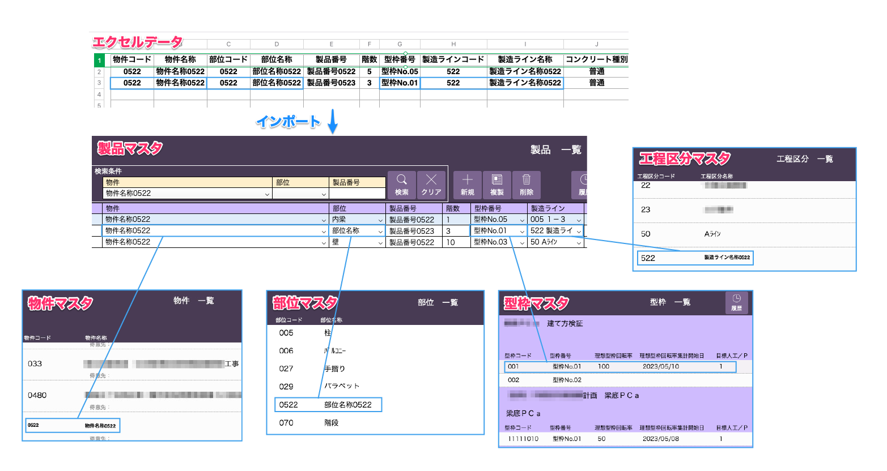

# 事前設定

 
<table><tr><td>

</td></tr></table>

製品マスタをシステムにインポートする前に、各マスタに項目内容を設定する(後述)必要があります。
製品マスタの項目と関連するマスタ、入力必須項目は以下の表をご参照ください。

| エクセル項目                              | 入力値例 | 必須項目 | マスタ事前設定 | 文字種、形式 | 備考
| :----------- | :----- | :----- | :------- |
| 製品管理コード | test001 | ● |  | 半角英数 |
| 物件コード | test | ● | 物件 | 半角英数 |
| 物件名称 | テスト工事 | | 物件 | |
| 物件略称 | テスト | | 物件 | |
| 部位コード1,2,3,4 | 01 | | 部位 | 半角英数 |
| 部位名称1,2,3,4 | 内梁 | | 部位 | |
| 製品番号 | A1-01 | ● | | | 命名規則を用いると荷姿票作成を効率的に行えます。(数字)E±(数字)などは指数として認識されてしまうため避けてください。例）1E-1
| 階数 | 1 | ● | | 半角数字 |
| 型枠番号 | 型枠No.01 | ● | 型枠 | |
| 製作工場 | 栃木 | ● | | | 栃木 or 茨城
| 製造ラインコード | 01 | ● | 工程区分 | 半角数字 |
| 製造ライン名称 | 1A東 | | 工程区分 | |
| 打設完了予定日 | 2025/01/01 | ● | | |
| 出荷予定日 | 2025/01/01 | | | yyyy/mm/dd |
| 写真撮影 | 有 | | | | 空白 or 有 or 無
| コンクリート種別 | 中庸熱 | | | |
| 立米1,2,3,4 | 4.1 | | | 半角数字 | 影響箇所：工程管理
| 配合1,2,3,4 | 60N | | コンクリート強度 | | 影響箇所：コンクリート品質管理
| 外注鉄筋業者コード | 001 | | 外注先 | |
| 外注鉄筋業者名称 | 〇〇会社 | | 外注先 | |
| ステータス | 打設完了 | | 製造ラインステータス | |