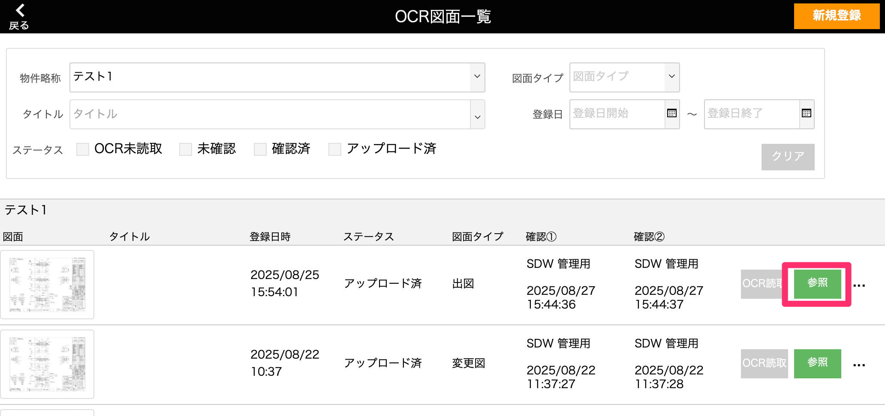

# OCR図面アップロードを行う

目次  
- [事前設定](#事前設定)   
- [新規登録](#新規登録)    
- [OCR読取](#ocr読取)  
- [図面内容編集](#図面内容編集)  
- [変更図の対象図面ID選択](#変更図の対象図面id選択) 
- [図面アップロード](#図面アップロード)  
- [OCR図面削除](#ocr図面削除)  

* * *

### 事前設定（変更図上書き対象外ステータス設定）
設定することで、変更図のアップロード設定時に対象製品のステータスが  
変更図上書き対象外ステータス以上の場合、デフォルトでアップロード対象外とすることができます。

1. [基幹システム]トップ画面から「製造ラインステータス」を選択します。

    <table><tr><td>
    
    </td></tr></table>

1. 変更図の上書きを対象外としたいステータスにチェックをつけます。 

    <table><tr><td>
    
    </td></tr></table> 

* * *

### 新規登録

1. [品質管理システム]トップ画面から「OCR図面アップロード」を選択します。
    
    <table><tr><td>
    
    </td></tr></table>

1. [OCR図面一覧]画面右上の「新規登録」を選択します。

    <table><tr><td>
    
    </td></tr></table>

1. 必須項目を入力して「登録」を選択して完了です。

    <table><tr><td>
    
    </td></tr></table>

    {: .warning }
    枚数が多いと登録に時間がかかります。

1. 登録が完了した図面は[OCR図面一覧]画面に表示されます。

    <table><tr><td>
    
    </td></tr></table>

 

* * *

### OCR読取

{: .warning }
OCR読取はMacもしくはiPadのみで使用できる機能となります。

1. [OCR図面一覧]画面でOCR読取を行いたい図面の「OCR読取」を選択します。

    <table><tr><td>
    
    </td></tr></table>

1. OCR読取を行いたい図面を選択します。

    <table><tr><td>
    
    </td></tr></table>

    {: .warning }
    読取箇所が違う図面は分けてOCR読取を行なってください。

1. 読み取りたい範囲を四角枠で囲います。読取範囲を指定したら、「次へ」を選択します。

    - 赤枠：部材名（製品番号）  
    - 青枠：図面番号

    <table><tr><td>
    
    </td></tr></table>

    {: .note }
    選択した図面の一枚目が表示されます。

1. OCR読取結果が表示されます。内容を確認したら「OCR保存」選択でOCR読取を完了します。

    <table><tr><td>
    
    </td></tr></table>

    {: .note }
    読み取った部材名と図面番号はこの画面上でも後からでも修正が可能です。

    {: .note }
    OCR読取を分けて行う場合は、読取図面選択画面まで戻って図面を選択し直してください。

    {: .warning }
    「OCR保存」を行うとOCR読取をやり直すことができなくなります。

 

* * *

### 図面内容編集

1. [OCR図面一覧]画面で編集を行いたい図面の「編集」を選択します。

    <table><tr><td>
    
    </td></tr></table>

1. OCR読取を行なった部材名と図面番号の手動修正を行います。確認したら「次へ」を選択します。

    <table><tr><td>
    
    </td></tr></table>

    - 入力例
    

    {: .note }
    記号や英数字はOCR読取時に自動で半角に統一されます。

1. 入力した図面番号と部材名が一覧で表示されます。

    <table><tr><td>
    
    </td></tr></table>

    - ①「成形後図面番号、成形後部材名」  
    　前画面でOCR読取、手動修正した内容が表示されます。
    - ②「紐づく製品番号」  
    　成形後部材名と製品マスタの製品番号を照合し、  
    　条件に一致する製品マスタの製品番号が表示されます。
    - ③「詳細」  
    　クリックで各図面を登録する対象の製品番号が表示されます。
    - ④「確認欄」  
    　チェックをつけると、確認者名と確認日時が登録されます。

1. 「詳細」クリックで図面をアップする対象の製品番号が一覧で表示されます。アップする図面IDや対象製品を変更することが可能です。  

    <table><tr><td>
    
    </td></tr></table>

    図面タイプごとのデフォルト設定は以下の通りです。  

    **出図の場合**  
    図面番号が登録されていないIDに左詰めで登録  

    **変更図の場合**  
    同じ図面番号が登録されている図面IDに上書き登録  

    ※以下のいずれかの条件に当てはまる場合はデフォルトはアップロード対象外とします。  
    - 同一の図面番号が登録されていない
    - 同一の図面番号が複数の図面IDに登録されている([参考](#変更図の対象図面id選択))
    - 製品のステータスが設定した上書き対象外ステータスを超えている([参考](#事前設定変更図上書き対象外ステータス設定))

 

* * *

### 変更図の対象図面ID選択

変更図をアップロードする際、同一の図面番号の図面が複数の図面ID(図面ID1~8)に登録されている製品番号が1件でもある場合の手順となります。  
変更図一覧画面上に「対象図面選択」ボタンが表示されなければ不要な手順となります。

<table><tr><td>

</td></tr></table>

1. [変更図一覧]画面右上の「対象図面ID選択」ボタンをクリックします。

    <table><tr><td>
    
    </td></tr></table>

1. 複数の図面IDに同一の図面番号が登録されている製品が表示されます。  
  図面画像を確認しながら、アップ対象とするか、どの図面IDにアップするかを選択することが可能です。

    <table><tr><td>
    
    </td></tr></table>

    {: .warning }
    [アップ対象選択]のチェックが外れた状態だと図面IDを選択できません。図面IDを選択する場合は[アップ対象選択]にチェックをつけてから行ってください。

 

* * *

### 図面アップロード

1. [出図・変更図一覧]画面の右上にある「アップロード」を選択して完了です。アップロード後は参照画面に切り替わります。

    <table><tr><td>
    
    </td></tr></table>

    {: .warning }
    確認欄①,②にチェックをつけることで図面のアップロードが可能となります。

    アップロード完了後、アップ対象となっていた製品の指定した図面IDに図面が登録されます。  
    また、製品の図面タブと図面描き込み画面に、以下の図面登録情報が表示されます。
    - 図面登録日
    - 図面タイプ
    - 図面番号

    <table><tr><td>
    
    </td></tr></table>
    <table><tr><td>
    
    </td></tr></table>

1. アップロードが完了した図面は編集不可となり、参照のみ可能となります。

    <table><tr><td>
    
    </td></tr></table>

 

* * *

### OCR図面削除

1. 図面の削除は[OCR図面一覧]画面から行うことができます。

    <table><tr><td>
    
    </td></tr></table>

    {: .warning }
    アップロード済みの図面は削除不可となります。
